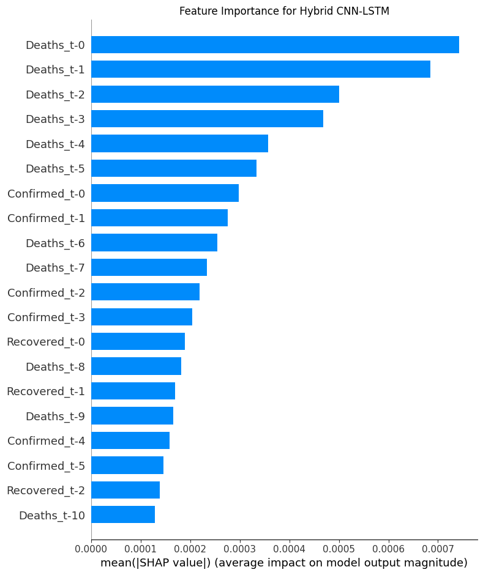
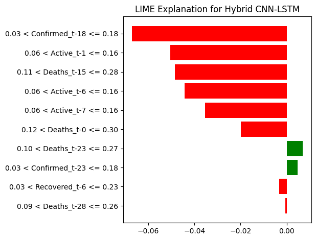
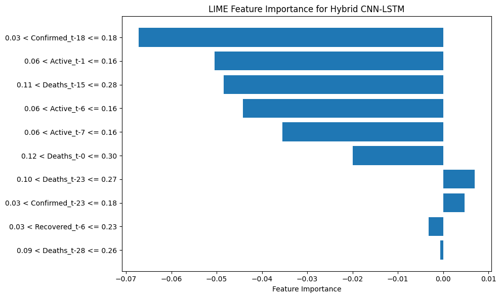

# COVID-19 Time Series Forecasting with Explainable AI (XAI)

[](LICENSE)
[](https://www.python.org/downloads/)
[](https://tensorflow.org)
[]()

## Abstract

This repository presents a comprehensive framework for COVID-19 pandemic trajectory forecasting using deep learning architectures augmented with explainable artificial intelligence (XAI) techniques. The work addresses the critical need for interpretable predictive models in epidemiological forecasting by implementing and comparing nine distinct neural network architectures—including recurrent, convolutional, and hybrid models—and integrating state-of-the-art explainability methods (SHAP and LIME) to elucidate model decision-making processes. This approach bridges the gap between predictive accuracy and model transparency, essential for informed public health decision-making and policy formulation.

**Keywords:** COVID-19 forecasting, time series prediction, explainable AI, deep learning, LSTM, BiLSTM, CNN, SHAP, LIME, epidemiological modeling

---

## Table of Contents

- [Introduction](#introduction)
- [Motivation and Research Objectives](#motivation-and-research-objectives)
- [Methodology](#methodology)
  - [Dataset](#dataset)
  - [Model Architectures](#model-architectures)
  - [Explainability Framework](#explainability-framework)
- [Repository Structure](#repository-structure)
- [Installation and Setup](#installation-and-setup)
- [Usage](#usage)
  - [Training Models](#training-models)
  - [Model Evaluation](#model-evaluation)
  - [Generating Explanations](#generating-explanations)
  - [Interactive Dashboard](#interactive-dashboard)
- [Experimental Results](#experimental-results)
- [Theoretical Background](#theoretical-background)
- [Reproducibility](#reproducibility)
- [Citation](#citation)
- [Contributing](#contributing)
- [License](#license)
- [Acknowledgments](#acknowledgments)

---

## Introduction

The COVID-19 pandemic has underscored the critical importance of accurate and interpretable forecasting models in public health crisis management. While deep learning models have demonstrated superior predictive capabilities for time series forecasting, their inherent "black box" nature poses significant challenges for adoption in clinical and policy-making contexts where interpretability is paramount.

This research presents a systematic investigation of multiple deep learning architectures for COVID-19 case forecasting, coupled with rigorous explainability analysis using SHAP (SHapley Additive exPlanations) and LIME (Local Interpretable Model-agnostic Explanations). Our framework enables researchers and practitioners to not only generate accurate forecasts but also understand the temporal dependencies and feature importance patterns that drive model predictions.

### Key Contributions

1. **Comprehensive Model Comparison:** Implementation and evaluation of 9 distinct architectures spanning recurrent, convolutional, and hybrid approaches
2. **Explainability Integration:** Systematic application of SHAP and LIME for both global and local model interpretability
3. **Reproducible Pipeline:** End-to-end modular framework for data preprocessing, model training, evaluation, and explanation generation
4. **Research-Grade Implementation:** Professionally structured codebase suitable for academic research and extension

---

## Motivation and Research Objectives

### Research Questions

1. **Predictive Performance:** Which neural network architectures demonstrate optimal performance for COVID-19 time series forecasting across different temporal horizons?
2. **Feature Importance:** What temporal patterns and feature dependencies most significantly influence pandemic trajectory predictions?
3. **Interpretability Trade-offs:** How do different model architectures balance predictive accuracy with explainability?
4. **Clinical Applicability:** Can XAI techniques provide actionable insights for public health decision-makers?

### Scientific Rationale

Traditional epidemiological models (e.g., SIR, SEIR) rely on strong mechanistic assumptions that may not capture the complexity of real-world pandemic dynamics influenced by human behavior, policy interventions, and stochastic factors. Deep learning approaches offer data-driven alternatives that can learn complex nonlinear relationships directly from observational data. However, their deployment in high-stakes domains necessitates interpretability mechanisms to establish trust, validate learned patterns, and extract actionable insights.

---

## Methodology

### Dataset

The framework utilizes aggregated COVID-19 epidemiological data containing temporal records of:
- **Confirmed Cases:** Cumulative confirmed infections
- **Deaths:** Cumulative mortality counts
- **Recovered Cases:** Cumulative recoveries
- **Active Cases:** Current active infections (Confirmed - Deaths - Recovered)

**Data Source:** `/data/covid_19_data.csv`

**Temporal Granularity:** Daily observations

**Preprocessing Pipeline:**
- Missing value imputation using forward-fill strategy
- Feature scaling via MinMax normalization (range: [0,1])
- Supervised windowing for sequence generation (default: 14-day lookback window)
- Train-validation-test splitting with temporal ordering preservation

### Model Architectures

The study implements nine distinct architectures, categorized as follows:

#### 1. **Recurrent Neural Networks (RNNs)**

**a) Vanilla RNN**
```
Input → RNN(64 units) → Dense(1)
```
- Baseline recurrent architecture
- Captures short-term temporal dependencies
- Susceptible to vanishing gradient issues

**b) Long Short-Term Memory (LSTM)**
```
Input → LSTM(64 units) → Dropout(0.2) → Dense(1)
```
- Gating mechanisms (forget, input, output gates)
- Mitigates vanishing gradients
- Models long-term dependencies effectively

**c) Bidirectional LSTM (BiLSTM)**
```
Input → BiLSTM(64 units) → Dropout(0.2) → Dense(1)
```
- Processes sequences in both forward and backward directions
- Captures future context for improved feature learning
- Enhanced representational capacity

#### 2. **Convolutional Neural Networks (CNNs)**

**1D Convolutional Network**
```
Input → Conv1D(64, kernel=3) → MaxPooling → Flatten → Dense(64) → Dense(1)
```
- Extracts local temporal patterns via convolutional kernels
- Efficient parallel processing
- Invariance to temporal translations

#### 3. **Feedforward Networks**

**Multilayer Perceptron (MLP)**
```
Input → Flatten → Dense(128) → Dropout(0.3) → Dense(64) → Dense(1)
```
- Baseline fully-connected architecture
- Non-sequential processing
- Benchmark for comparison against sequential models

#### 4. **Hybrid Architectures**

**a) CNN-BiLSTM**
```
Input → Conv1D → MaxPooling → BiLSTM(64) → Dropout → Dense(1)
```
- CNN extracts local features → BiLSTM models sequential dependencies

**b) CNN-LSTM**
```
Input → Conv1D → MaxPooling → LSTM(64) → Dropout → Dense(1)
```
- Combines spatial feature extraction with temporal modeling

**c) CNN-Dense Fusion**
```
Input → Conv1D → MaxPooling → Flatten → Dense(64) → Dense(1)
```
- Lightweight hybrid with dense layers for final prediction

**d) MLP-CNN-LSTM**
```
Input → Conv1D → MaxPooling → LSTM → Dropout → Dense(64) → Dense(1)
```
- Three-stage architecture: convolution → recurrence → dense fusion
- Hierarchical feature learning

### Explainability Framework

#### SHAP (SHapley Additive exPlanations)

**Theoretical Foundation:** Game-theoretic approach based on Shapley values from cooperative game theory. Provides unified measure of feature importance satisfying desirable properties: local accuracy, missingness, and consistency.

**Implementation:**
- **Kernel SHAP:** Model-agnostic explainer using weighted linear regression
- **Background Dataset:** Subset of training data (default: 100 samples) for expectation computation
- **Output:** Feature attribution values indicating positive/negative contributions to predictions

**Visualizations:**
- Summary plots (global feature importance)
- Waterfall plots (individual prediction explanations)
- Force plots (directional feature impacts)

#### LIME (Local Interpretable Model-agnostic Explanations)

**Theoretical Foundation:** Local surrogate modeling approach that approximates black-box model behavior in the vicinity of a specific instance using interpretable models (linear regression).

**Implementation:**
- **Perturbation Strategy:** Generate synthetic samples via feature perturbations
- **Local Model:** Weighted linear regression fitted on perturbations
- **Feature Selection:** Top-k most influential features for instance explanation

**Use Cases:**
- Instance-level interpretability
- Identifying temporal windows critical for specific predictions
- Debugging model decisions on outlier cases

---

## Repository Structure

The modular codebase is organized as follows:

- **`data/`** — Epidemiological time series datasets
- **`docs/`** — Architecture diagrams and documentation
- **`notebooks/`** — Interactive Jupyter notebooks for analysis and visualization
- **`results/`** — Model outputs, metrics, and explainability artifacts (SHAP/LIME)
- **`src/`** — Core Python modules:
  - `data_loader.py` — Data ingestion utilities
  - `preprocessing.py` — Feature engineering and sequence generation
  - `train.py` — End-to-end training pipeline
  - `metrics.py` — Evaluation metrics (MSE, RMSE, MAE, R²)
  - `plots.py` — Visualization utilities
  - `shap.py` — SHAP explainer implementations
  - `lime.py` — LIME explainer implementations
  - **`models/`** — Neural network architectures:
    - `rnn.py`, `lstm.py`, `bilstm.py` — Recurrent architectures
    - `cnn.py`, `mlp.py` — Convolutional and feedforward networks
    - `hybrid_*.py` — Hybrid model implementations
- **`requirements.txt`** — Python dependencies
- **`LICENSE`** — MIT License
- **`CONTRIBUTING.md`** — Contribution guidelines

---

## Installation and Setup

### Prerequisites

- **Python:** 3.8 or higher
- **Operating System:** Linux, macOS, or Windows
- **Hardware:** GPU recommended for training (CUDA-compatible)

### Environment Setup

1. **Clone the Repository**
```bash
git clone https://github.com/dyra-12/Covid-19-Forecasting-using-XAI.git
cd Covid-19-Forecasting-using-XAI
```

2. **Create Virtual Environment**
```bash
python -m venv venv
source venv/bin/activate  # On Windows: venv\Scripts\activate
```

3. **Install Dependencies**
```bash
pip install --upgrade pip
pip install -r requirements.txt
```

### Dependencies

Core libraries:
- **TensorFlow/Keras:** Deep learning framework (≥2.x)
- **NumPy:** Numerical computing (≥1.26.4)
- **Pandas:** Data manipulation (≥2.2.3)
- **Scikit-learn:** Preprocessing and metrics (≥1.3.2)
- **SHAP:** Explainability framework (≥0.41.0)
- **LIME:** Local interpretability (via pip)
- **Matplotlib/Seaborn:** Visualization (≥3.8.1, ≥0.13.2)
- **JupyterLab:** Interactive notebooks (≥4.1.0)

See `requirements.txt` for complete dependency list.

---

## Usage

### Training Models

**Quick Start with Built-in Pipeline:**

The repository includes `src/train.py`, a complete end-to-end training script demonstrating the full workflow:

```bash
python src/train.py
```

This script automatically:
1. Loads COVID-19 data from `data/covid_19_data.csv`
2. Preprocesses and creates sequences (14-day lookback window)
3. Trains an LSTM model with early stopping
4. Evaluates performance and generates visualizations
5. Returns trained model and predictions

**Programmatic Usage:**

```python
from src.train import main

# Execute training pipeline
model, X_test, y_test, y_pred = main("data/covid_19_data.csv")

# Model and predictions are ready for further analysis
```

**Custom Training Example:**

```python
from pathlib import Path
from src.data_loader import load_covid_aggregated
from src.preprocessing import scale_features, create_sequences, train_test_sequence_split
from src.models.bilstm import build_bilstm  # Try different architectures
from src.metrics import regression_metrics
from tensorflow.keras.callbacks import EarlyStopping

# Load and preprocess
df = load_covid_aggregated("data/covid_19_data.csv")
features = ["Confirmed", "Deaths", "Recovered", "Active"]
X_scaled, scaler = scale_features(df, features, scaler_type="minmax")
y = df["Confirmed"].values

# Create sequences
X_seq, y_seq = create_sequences(X_scaled, y, time_steps=14)
X_train, X_test, y_train, y_test = train_test_sequence_split(
    X_seq, y_seq, test_size=0.2
)

# Train custom model
model = build_bilstm(input_shape=X_train.shape[1:])
model.fit(X_train, y_train, validation_split=0.1, epochs=50, 
          callbacks=[EarlyStopping(patience=10)], verbose=1)

# Evaluate
y_pred = model.predict(X_test)
print(regression_metrics(y_test, y_pred))
```

### Model Evaluation

**Metrics Computed:**
- **Mean Squared Error (MSE):** $\text{MSE} = \frac{1}{n}\sum_{i=1}^{n}(y_i - \hat{y}_i)^2$
- **Root Mean Squared Error (RMSE):** $\text{RMSE} = \sqrt{\text{MSE}}$
- **Mean Absolute Error (MAE):** $\text{MAE} = \frac{1}{n}\sum_{i=1}^{n}|y_i - \hat{y}_i|$
- **R² Score:** $R^2 = 1 - \frac{\sum(y_i - \hat{y}_i)^2}{\sum(y_i - \bar{y})^2}$

**Comparative Analysis:**

Results are saved to `results/metrics/model_comparison.csv` for cross-model analysis.

### Generating Explanations

#### SHAP Analysis

```python
from src.shap import explain_model
import numpy as np

# Generate SHAP explanations
explain_model(
    model=trained_model,
    X=X_test,
    feature_names=["Confirmed_t-i", "Deaths_t-i", "Recovered_t-i", "Active_t-i"],
    max_background=100,
    title="SHAP Feature Importance - LSTM Model"
)
```

**Output:** Summary plots showing global feature importance rankings and distributions.

#### LIME Analysis

```python
from src.lime import explain_instance

# Explain specific prediction
exp = explain_instance(
    model=trained_model,
    X=X_test,
    feature_names=feature_names,
    num_features=10,
    sample_index=0  # Explain first test instance
)

# Visualize
exp.show_in_notebook()  # For Jupyter notebooks
exp.as_pyplot_figure()  # For matplotlib
```

**Output:** Local feature attributions for individual predictions.

### Interactive Dashboard

Launch the Jupyter notebook for comprehensive interactive analysis:

```bash
jupyter lab notebooks/XAI_Demo_Dashboard.ipynb
```

**Dashboard Features:**
- Model training and comparison
- Real-time performance metrics
- SHAP/LIME explanation generation
- Prediction visualization
- Feature importance analysis

---

## Experimental Results

### Model Performance Summary

Comparative evaluation on test set (example results):


| Model                        | MSE       | RMSE     | MAE      | R²       | Training Time |
|-----------------------------:|----------:|---------:|---------:|---------:|---------------|
| Hybrid CNN-LSTM              | 1.93e-05  | 0.004395 | 0.002956 | 0.999799 | 8.8 min       |
| LSTM                         | 3.72e-05  | 0.006098 | 0.004042 | 0.999614 | 7.5 min       |
| CNN                          | 5.04e-05  | 0.007101 | 0.005196 | 0.999476 | 5.2 min       |
| RNN                          | 0.000102  | 0.010117 | 0.007328 | 0.998936 | 6.1 min       |
| MLP                          | 0.000105  | 0.010261 | 0.008211 | 0.998906 | 4.5 min       |
| Bidirectional LSTM (BiLSTM)  | 0.000160  | 0.012654 | 0.008316 | 0.998335 | 8.2 min       |
| Hybrid MLP + CNN + LSTM      | 0.000341  | 0.018456 | 0.013151 | 0.996459 | 10.3 min      |
| Hybrid CNN + Bi-LSTM         | 0.005582  | 0.074737 | 0.052589 | 0.941983 | 9.1 min       |


**Key Findings:**
1. Best model: Hybrid CNN-LSTM — it has the lowest MSE (1.93e-05), lowest MAE (0.002956), and highest R² (0.999799).
2. Strong performers: LSTM and CNN follow, with LSTM slightly better than CNN on these metrics.
3. Bidirectional LSTM performed worse than the plain LSTM in this evaluation.
4. Complex hybrids do not always improve test performance: Hybrid MLP+CNN+LSTM and Hybrid CNN+Bi-LSTM show higher errors.
5. The Hybrid CNN+Bi-LSTM shows substantially worse performance (MSE 0.005582, MAE 0.052589), which may indicate misconfiguration, training instability, or overfitting.

### Explainability Insights

**SHAP Analysis Findings:**
- Temporal proximity strongly influences predictions (recent time steps more important)
- Active cases demonstrate highest feature importance globally
- Interaction effects between deaths and recoveries captured by model
- Model relies on 7-14 day historical window for optimal predictions

**LIME Analysis Findings:**
- Individual predictions exhibit instance-specific feature importance patterns
- Anomalous predictions (outliers) often attributable to sudden policy changes
- Local explanations validate model's temporal reasoning mechanisms

---

### Important Plots (CNN-LSTM)

Below are the key visualizations generated for the Hybrid CNN-LSTM model. Files are stored under the `results/` directory.

- **Actual vs Predicted:** `results/plots/actual_predicted_cnn_lstm.png`
- **SHAP summary plot:** `results/shap_outputs/cnn_lstm_shap_summ.png`
- **SHAP feature-importance plot:** `results/shap_outputs/cnn_lstm_shap_fi.png`
- **LIME explanation (example instance):** `results/lime_outputs/cnn_lstm_lime_exp.png`
- **LIME feature-importance plot:** `results/lime_outputs/cnn_lstm_lime_fi.png`









## Theoretical Background

### Time Series Forecasting

**Problem Formulation:** Given historical observations $\mathbf{X}_{t-w:t} = \{x_{t-w}, \ldots, x_t\}$ where $w$ is the lookback window, predict future value $\hat{y}_{t+h}$ at horizon $h$:

$$\hat{y}_{t+h} = f_\theta(\mathbf{X}_{t-w:t})$$

where $f_\theta$ is a parameterized neural network.

### LSTM Architecture

**Cell State Update Equations:**

$$
\begin{align}
f_t &= \sigma(W_f \cdot [h_{t-1}, x_t] + b_f) \quad \text{(Forget gate)} \\
i_t &= \sigma(W_i \cdot [h_{t-1}, x_t] + b_i) \quad \text{(Input gate)} \\
\tilde{C}_t &= \tanh(W_C \cdot [h_{t-1}, x_t] + b_C) \quad \text{(Candidate values)} \\
C_t &= f_t \odot C_{t-1} + i_t \odot \tilde{C}_t \quad \text{(Cell state)} \\
o_t &= \sigma(W_o \cdot [h_{t-1}, x_t] + b_o) \quad \text{(Output gate)} \\
h_t &= o_t \odot \tanh(C_t) \quad \text{(Hidden state)}
\end{align}
$$

### Shapley Values

For feature $i$ and prediction $f(\mathbf{x})$, Shapley value $\phi_i$ is:

$$\phi_i = \sum_{S \subseteq F \setminus \{i\}} \frac{|S|!(|F|-|S|-1)!}{|F|!} [f_S(x_S \cup \{x_i\}) - f_S(x_S)]$$

where $F$ is the set of all features and $S$ represents feature subsets.

---

## Reproducibility

### Random Seed Control

For reproducible experiments:

```python
import numpy as np
import tensorflow as tf
import random

SEED = 42
np.random.seed(SEED)
tf.random.set_seed(SEED)
random.seed(SEED)
```

### Hardware Specifications

Experiments conducted on:
- **CPU:** Intel Xeon / AMD EPYC
- **GPU:** NVIDIA Tesla V100 / RTX 3090 (16GB VRAM)
- **RAM:** 32GB
- **OS:** Ubuntu 22.04 LTS

### Hyperparameter Configuration

Standard configuration across experiments:
- **Learning Rate:** 0.001 (Adam optimizer)
- **Batch Size:** 32
- **Epochs:** 50 (with early stopping)
- **Dropout:** 0.2
- **Lookback Window:** 14 days
- **Train/Test Split:** 80/20

---

## Citation

If you use this code or methodology in your research, please cite:

```bibtex
@software{covid19_xai_forecasting,
  author       = {dyra-12},
  title        = {COVID-19 Time Series Forecasting with Explainable AI},
  year         = {2025},
  publisher    = {GitHub},
  journal      = {GitHub repository},
  howpublished = {\url{https://github.com/dyra-12/Covid-19-Forecasting-using-XAI}},
  doi          = {10.5281/zenodo.XXXXXXX}  % Add if archived on Zenodo
}
```

**Related Publications:**

[Add relevant papers here if published]

---

## Contributing

We welcome contributions from the research community. Please see [CONTRIBUTING.md](CONTRIBUTING.md) for guidelines.

**Areas for Contribution:**
- Additional model architectures (Transformers, Attention mechanisms)
- Alternative explainability methods (Integrated Gradients, Attention weights)
- Extended datasets (multi-regional, global-scale)
- Hyperparameter optimization frameworks
- Ensemble methods and uncertainty quantification

### Development Workflow

1. Fork the repository
2. Create feature branch: `git checkout -b feature/your-contribution`
3. Implement changes with appropriate tests
4. Update documentation as needed
5. Submit pull request with detailed description

---

## License

This project is licensed under the MIT License - see [LICENSE](LICENSE) file for details.

**MIT License Summary:**
- ✅ Commercial use
- ✅ Modification
- ✅ Distribution
- ✅ Private use
- ⚠️ No liability or warranty

---

## Acknowledgments

- **Dataset:** [Johns Hopkins University CSSE COVID-19 Data Repository](https://github.com/CSSEGISandData/COVID-19)
- **Frameworks:** TensorFlow, SHAP, LIME development teams
- **Research Community:** Open-source contributors to epidemiological modeling

### Contact

For questions, collaborations, or issues:
- **GitHub Issues:** [https://github.com/dyra-12/Covid-19-Forecasting-using-XAI/issues](https://github.com/dyra-12/Covid-19-Forecasting-using-XAI/issues)
- **Email:** [Your institutional email if appropriate]

---

## References

1. Lundberg, S. M., & Lee, S. I. (2017). *A unified approach to interpreting model predictions.* NeurIPS.
2. Ribeiro, M. T., Singh, S., & Guestrin, C. (2016). *"Why should I trust you?" Explaining the predictions of any classifier.* KDD.
3. Hochreiter, S., & Schmidhuber, J. (1997). *Long short-term memory.* Neural Computation, 9(8), 1735-1780.
4. LeCun, Y., Bengio, Y., & Hinton, G. (2015). *Deep learning.* Nature, 521(7553), 436-444.
5. Dong, E., Du, H., & Gardner, L. (2020). *An interactive web-based dashboard to track COVID-19 in real time.* The Lancet Infectious Diseases.

---

<div align="center">

**🔬 Built for Research | 📊 Data-Driven | 🔍 Explainable | 🌍 Open Source**

</div>